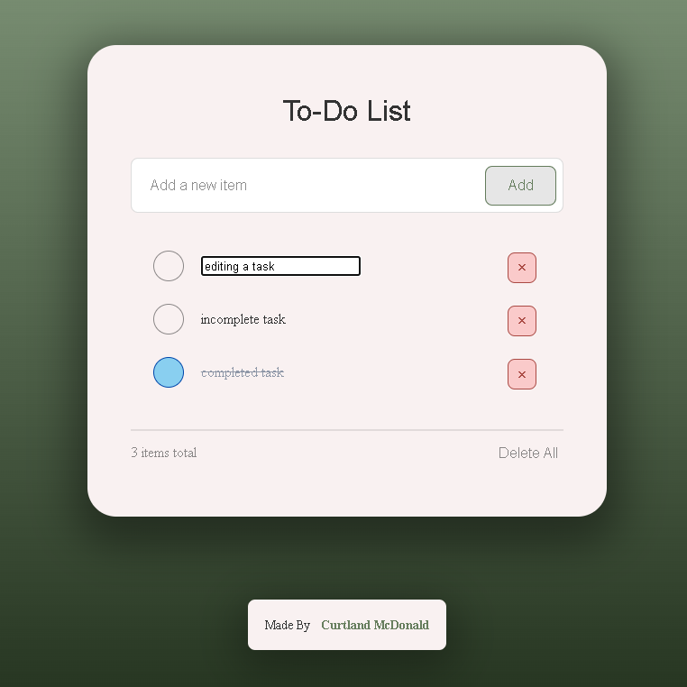

<!-- Title and Description -->
<h1>To-Do List Web Application</h1>
<p>A simple, modern to-do list web application with a beautiful forest-themed gradient interface.
This application helps users manage their tasks with a clean, intuitive design and smooth interactions.</p>

<br />

<!-- Features -->
<h2>Features</h2>
<ul>
  <li>
    <b>Task Management</b>
    <ul>
      <li>Add tasks using the input field and clicking the <b>Add</b> button or <b>[ENTER]</b> key</li>
      <li>Mark tasks as complete/incomplete with a stylish checkbox</li>
      <li>Edit existing tasks by clicking on them</li>
      <li>Delete individual tasks</li>
      <li>Delete all tasks at once</li>
    </ul>
  </li>
  <li>
    <b>User Experience</b>
    <ul>
      <li>Responsive design that works on all screen sizes</li>
      <li>Elegant forest-themed color scheme</li>
      <li>Smooth animations and transitions</li>
      <li>Custom-styled scrollbar</li>
      <li>Real-time task counter</li>
    </ul>
  </li>
  <li>
    <b>Data Persistence</b>
    <ul>
      <li>Tasks automatically save to browser's local storage</li>
      <li>Preserves task status across browser sessions</li>
    </ul>
  </li>
</ul>

<!-- Technologies Used -->
<h2>Technologies Used</h2>
<ul>
  <li>HTML5</li>
  <li>CSS3 (with custom properties and modern features)</li>
  <li>JavaScript</li>
  <li>Local Storage API</li>
</ul>

<!-- Installation -->
<h2>Installation</h2>
<ol type="1">
  <li><b>Clone the repository:</b></li>

```bash
# git command to run in shell
git clone https://github.com/curtlandmcdonald/to-do-list-app.git
```

<li><b>Navigate to the project directory:</b></li>

```bash
# shell command
cd to-do-list-app
```

<li><b>Open</b> <code>index.html</code> <b>in your preferred web browser.</b></li>
</ol>

<!-- Usage -->
<h2>Usage</h2>
<ul>
  <li>
    <b>Adding Tasks</b>
    <ul>
      <li>Type your task in the input field</li>
      <li>Click the <b>Add</b> button or press <b>[ENTER]</b></li>
    </ul>
  </li>
  <li>
    <b>Managing Tasks</b>
    <ul>
      <li>Click the checkbox to mark a task as complete</li>
      <li>Click on the tasks's text to edit it</li>
      <li>Click the <b>X</b> button to delete a specific task</li>
      <li>Click <b>Delete All</b> to remove all tasks</li>
    </ul>
  </li>
  <li>
    <b>Data Persistence</b>
    <ul>
      <li>Tasks are automatically saved to your current browser</li>
      <li>Close and reopen your browser - your tasks will still be there!</li>
    </ul>
  </li>
</ul>

<!-- Styling -->
<h2>Styling</h2>
<p>This application features a carefully crafted design with:</p>
<ul>
  <li>Forest-themed gradient background</li>
  <li>Rounded corners for a modern look</li>
  <li>Custom checkbox animations</li>
  <li>Accessible color contrast</li>
  <li>Soft shadows for depth</li>
  <li>Intuitive hover states</li>
</ul>

<!-- Project Structure -->
<h2>Project Structure</h2>

```bash
todo-list-app/
│
├── index.html          # Main HTML structure
├── style.css          # CSS styling and animations
├── script.js         # JavaScript application logic
├── README.md        # Project documentation
└── LICENSE.md      # Project license
```

<!-- License -->
<h2>License</h2>
<p>This project is licensed under the MIT License - see the LICENSE file for details.</p>

<!-- Author -->
<h2>Author</h2>
<p>Curtland McDonald</p>

<!-- Acknowledgements -->
<h2>Acknowledgements</h2>
<ul>
  <li>
    <a href="https://youtu.be/3OqWCGVaOkA?si=6yytM6lC-KKDdqce">Original Tutorial</a>
  </li>
  <li>
    <a href="https://support.google.com/sites/answer/7529116?hl=en">Accessiblity Guidelines</a>
  </li>
</ul>


